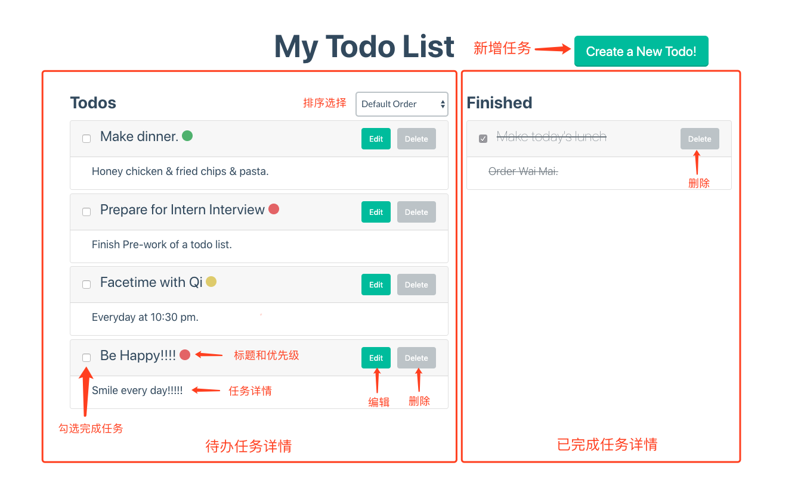
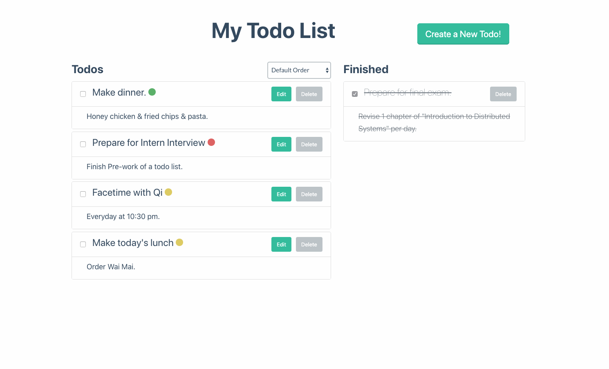
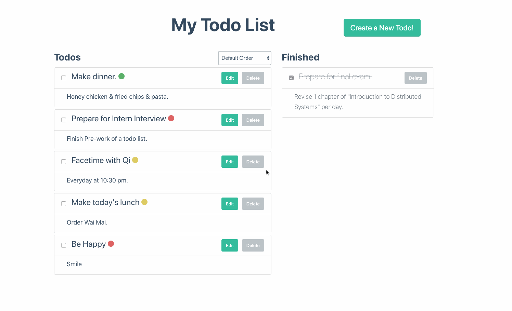
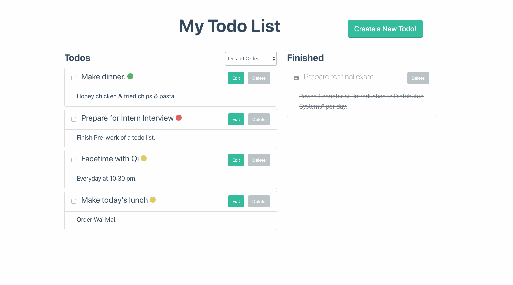
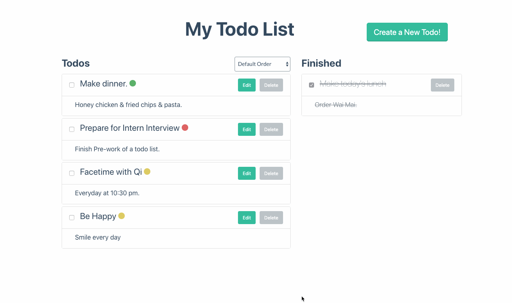
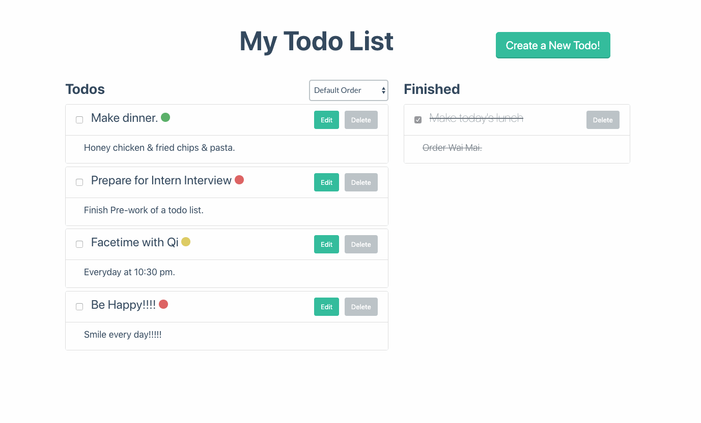

# Pre-Work: Todo List

Author: Xiaohan Zhu | xiaohan.zhu@outlook.com

### 项目简介
此项目主要使用**Django + Django Rest Framework + Bootstrap(flay-ui) + React**完成了一个待办事项网站。

### 功能概览
此项目实现的功能有：

- 增加一个待办事项
  - 事项标题
  - 事项内容
  - 优先级
- 删除一个待办事项
- 标记、反标记一个待办事项为已完成
- 编辑一个待办事项的具体内容
  - 事项标题
  - 事项内容
  - 优先级
- 列出所有的事项（待办和已完成）
- 支持按照不同方式排序
  - 添加顺序
  - 优先级顺序

#### 网页结构

#### 增加待办事项
点击右上角按钮，在弹窗中输入事项标题、内容和优先级。

#### 删除待办事项
点击每个事项右侧灰色删除按钮。

#### 标记待办事项为完成/未完成
勾选每个事项左侧checkbox.

#### 编辑待办事项具体内容
点击每个事项右侧编辑按钮，在弹窗中修改事项标题、内容和优先级。

#### 按照添加顺序和优先级顺序排序
点击Select选择需要的排序方式。

### 使用版本
Django 1.8.19

Python 2.7
